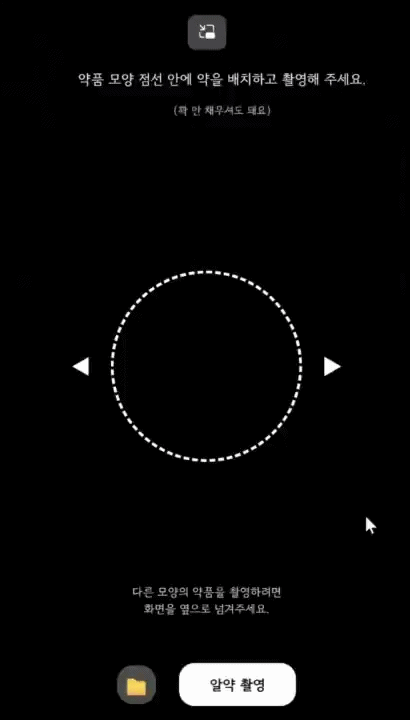
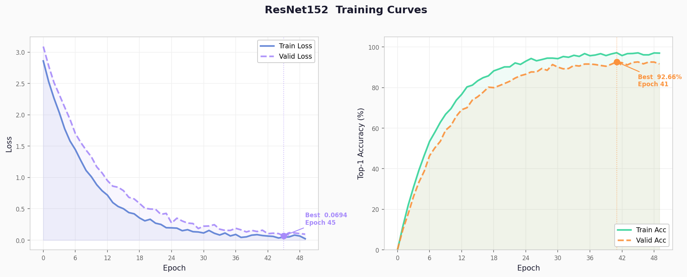

# 💊 똑똑약사 (Smart Pill-Master)
### 오남용 없는 안전한 복약 파트너 | AI-Powered Pill Identification Service

> 시각장애인·고령층 등 시각 약자들이 알약을 식별하지 못해 겪는 오투약·약물 오남용의 위험을 해소하기 위해 기획된  
> CNN + OCR 기반 AI 알약 인식 서비스. 알약 사진 한 장으로 약품 정보를 TTS 음성으로 안내합니다.

**개발 기간** : 2026년 3월 ~ 4월 (약 5주) | **개발 인원** : 3인 팀 프로젝트

<br>

## 🎬 시연 영상 | Demo



<br>

## 📖 프로젝트 소개 | Introduction

**똑똑약사**는 스마트폰 카메라로 알약을 촬영하면 **딥러닝 AI**가 약품을 인식하고, 효능·복용법·주의사항을 **TTS(음성)** 로 안내해주는 AI 기반 웹 애플리케이션입니다.

> 💡 **핵심 기술**: ResNet-152 CNN + CLIP 교차검증 + OCR 각인 인식의 **3중 듀얼 파이프라인**으로 1,000종 알약을 실시간 분류

- **🤖 딥러닝 기반 인식** — ResNet-152로 1,000 클래스 알약 이미지 분류, Top-1·Top-2 차이 및 Top-5 엔트로피로 3중 확신 판단
- **🔍 CLIP 교차검증** — 비알약 이미지 1차 차단(OOD 필터) 및 ResNet·OCR 충돌 시 중재자로 재호출
- **📝 OCR 각인 인식** — EasyOCR 5가지 전처리 버전 최빈값 채택, PaddleOCR 폴백으로 각인 교차 검증
- **🛡️ DB Fallback** — AI 실패 시 색상·모양·각인 조합으로 DB에서 후보 검색 (5단계 우선순위)
- **🔊 TTS 친화적 응답** — 신뢰도·방법·약품 정보를 음성 낭독에 최적화된 포맷으로 반환

<br>

## 🛠️ 기술 스택 | Tech Stack

| 구분 | 기술 |
|------|------|
| **AI 모델** | **ResNet-152** (1,000클래스 알약 분류), **CLIP** (OpenAI, 비알약 필터·교차검증) |
| **OCR** | **EasyOCR** (기본, 5가지 전처리 버전), **PaddleOCR** (폴백) |
| **이미지 처리** | OpenCV (CLAHE·Canny·모폴로지), Pillow, imgaug (증강), scikit-image |
| **색상/모양 감지** | KMeans 클러스터링 (scikit-learn), approxPolyDP (OpenCV) |
| **AI 프레임워크** | PyTorch 2.6+, TorchVision 0.21+, Transformers (HuggingFace) |
| **Backend** | Python 3.10, Django 4.2, Django REST Framework, django-cors-headers |
| **Frontend** | React, JavaScript, Web Speech API (TTS), Canvas API, Axios |
| **Database** | MariaDB |
| **서버** | Django Development Server |
| **협업** | Notion, GitHub, Google WebSheet |

<br>

## 👥 팀 구성 | Team

| 역할 | 담당 |
|------|------|
| 팀원1 | 데이터 수집, 웹 크롤링, DB 구축 |
| 팀원2 (본인) | 백엔드, AI 파이프라인, API 설계 |
| 팀원3 | 프론트엔드, UI/UX, TTS, 카메라 인터페이스 |

<br>

## 📊 AI 모델 성능 | AI Model Performance

| 지표 | 수치 |
|------|------|
| 모델 | ResNet-152 |
| 학습 클래스 수 | 1,000종 |
| Top-1 Accuracy | **92.66%** (Validation, Epoch 41) |
| 학습 데이터 | 국내 다빈도 의약품 ~5,000품목 |
| GPU 환경 추론 속도 | TBD |
| CPU 환경 추론 속도 | 이미지 1장당 6~8초 |

### 📈 학습 곡선 | Training Curves



> Best Validation Loss: **0.0694** (Epoch 45) · Best Validation Accuracy: **92.66%** (Epoch 41)

<br>

## ⚙️ 설치 및 실행 방법 | Getting Started

### 사전 요구사항 | Prerequisites

- Python 3.10 이상
- Node.js 18 이상
- MariaDB 설치 및 실행 중
- CUDA 12.8 이상 (GPU 사용 시, RTX 5090 포함)

---

### Backend

#### 1. 레포지토리 클론 | Clone Repository

```bash
git clone https://github.com/libguim/Smart-Pill-Project.git
cd Smart-Pill-Project
```

#### 2. 가상환경 생성 및 활성화 | Virtual Environment

기존 환경이 활성화되어 있다면 먼저 비활성화합니다.

```bash
conda deactivate
```

새 가상환경을 생성하고 활성화합니다.

```bash
conda create -n smart_pill_1 python=3.10
conda activate smart_pill_1
```

#### 3. PyTorch 설치 | Install PyTorch ⚠️ 먼저 설치 필수

> `requirements.txt` 설치 전에 반드시 PyTorch를 먼저 설치해야 합니다.

```bash
# GPU 사용 (RTX 5090 / CUDA 12.8)
pip install torch>=2.6.0 torchvision>=0.21.0 --extra-index-url https://download.pytorch.org/whl/cu128

# CPU만 사용
pip install torch>=2.6.0 torchvision>=0.21.0
```

#### 4. 패키지 설치 | Install Dependencies

```bash
pip install --no-cache-dir --ignore-installed -r requirements.txt
```

#### 5. 데이터베이스 생성 | Create Database ⚠️ 필수 선행 작업

MariaDB에 접속 후 아래 SQL을 실행합니다.

```sql
CREATE DATABASE webdb CHARACTER SET utf8mb4 COLLATE utf8mb4_unicode_ci;
CREATE USER 'pill_user'@'localhost' IDENTIFIED BY 'pill1234';
GRANT ALL PRIVILEGES ON webdb.* TO 'pill_user'@'localhost';
FLUSH PRIVILEGES;
```

`pill.sql`을 import하여 초기 데이터를 삽입합니다.

```bash
mysql -u pill_user -p webdb < pill.sql
```

#### 6. AI 모델 가중치 배치 | Place AI Model Weights ⚠️ 필수

학습된 모델 파일(`pill_resnet152_dataclass01_aug0.pt`)을 아래 경로에 복사합니다.

```
pills/ai_models/pill_resnet152_dataclass01_aug0.pt
```

> 모델 파일은 용량 문제로 Git에 포함되지 않습니다. 팀 공유 드라이브에서 다운로드하세요.

#### 7. AI 모델 인덱스 맵 생성 | Generate Pill Index Map

> ⚠️ 반드시 프로젝트 루트(`manage.py`가 있는 위치)에서 실행해야 합니다.

AI 모델 라벨과 DB의 `item_seq`를 연결하는 매핑 파일을 생성합니다.

```bash
# 프로젝트 루트에서 실행
python make_map.py
```

실행 후 `pills/ai_models/pill_index_map.json`이 생성됩니다.

#### 8. Django 마이그레이션 및 서버 실행 | Run Backend

```bash
python manage.py migrate --fake-initial
python manage.py runserver
```

> 접속: **`http://localhost:8000`**

---

### Frontend

#### 9. 프론트엔드 의존성 설치 및 실행 | Install & Run Frontend

```bash
cd frontend
npm install
npm start
```

> 접속: **`http://localhost:3000`**

> 프록시 설정(`setupProxy.js`)이 적용되어 `/api` 요청이 `http://localhost:8000`으로 자동 전달됩니다.

---

## 🧠 AI 아키텍처 | AI Architecture

알약 한 장의 이미지로 3단계 AI 파이프라인을 거쳐 약품을 식별합니다.

```
📷 이미지 입력
    │
    ▼
┌─────────────────────────────┐
│  1단계: CLIP 비알약 필터      │  ← 비알약 이미지 즉시 차단 (OOD)
└─────────────────────────────┘
    │ 알약 확인됨
    ▼
┌─────────────────────────────┐
│  2단계: ResNet-152 분류      │  ← 1,000 클래스 CNN 추론
│  Top-1·Top-2 차이           │     Top-5 엔트로피 3중 확신 판단
└─────────────────────────────┘
    │                │
    │ 확신           │ 불확실
    ▼                ▼
┌──────────┐   ┌──────────────────────────┐
│ 3단계:   │   │  DB Fallback 검색         │
│ OCR 교차 │   │  각인 + 색상 + 모양 조합  │
│ 검증     │   │  5단계 우선순위 탐색       │
└──────────┘   └──────────────────────────┘
    │
    ▼
┌─────────────────────────────┐
│  CLIP 중재 (충돌 시)         │  ← ResNet vs OCR 충돌 시 최종 판단
└─────────────────────────────┘
    │
    ▼
💊 약품 정보 + TTS 음성 안내
```

<br>

## 🌐 API 엔드포인트 | API Endpoints

| Method | URL | 설명 |
|--------|-----|------|
| `POST` | `/api/pills/analyze/` | 알약 이미지 업로드 → AI 분석 결과 반환 |
| `GET` | `/api/pills/search/?q=검색어` | 약품명·각인 텍스트 검색 |
| `GET` | `/api/pills/` | 약품 마스터 목록 조회 |
| `GET` | `/api/pills/{id}/` | 약품 단건 상세 조회 |

### 분석 응답 예시 (`POST /api/pills/analyze/`)

```json
{
  "status": "success",
  "method": "CNN 딥러닝 이미지 인식, ResNet-152 모델 사용",
  "confidence": "매우 높음, 95.50퍼센트",
  "dl_name": "타이레놀정500밀리그램",
  "dl_company": "한국얀센",
  "drug_shape": "장방형",
  "color_class1": "하양",
  "print_front": "TYLENOL",
  "print_back": null,
  "effect_text": "...",
  "usage_text": "...",
  "warning_text": "...",
  "storage_text": "...",
  "tip": null
}
```

<br>
